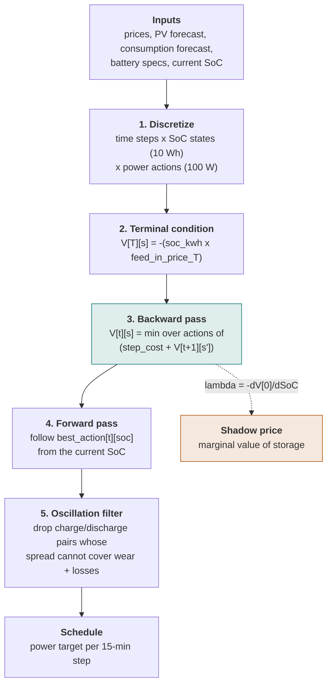

# Algorithm: How Battery Controller Optimizes Your Schedule

This document explains step by step how the dynamic programming (DP) engine in Battery Controller calculates the optimal charge/discharge schedule for your battery.

For the operational side — coordinators, intervals, and why the schedule changes between runs — see [How it works](how-it-works.md).



---

## Table of Contents

1. [Problem Statement](#1-problem-statement)
2. [Inputs](#2-inputs)
3. [State Space Discretization](#3-state-space-discretization)
4. [Cost Function (Step Cost)](#4-cost-function-step-cost)
5. [Terminal Condition](#5-terminal-condition)
6. [Backward Pass (Backward Induction)](#6-backward-pass-backward-induction)
7. [Forward Pass (Schedule Extraction)](#7-forward-pass-schedule-extraction)
8. [Post-Processing Filters](#8-post-processing-filters)
9. [Shadow Price Calculation](#9-shadow-price-calculation)
10. [Rolling-Horizon Execution](#10-rolling-horizon-execution)
11. [Numerical Considerations](#11-numerical-considerations)
12. [Multi-Battery Dispatch](#12-multi-battery-dispatch)

---

## 1. Problem Statement

The optimizer answers this question for every 15-minute run:

> **Given the current battery state of charge (SoC) and forecasts of prices, PV production, and household consumption for the next N hours, what charge/discharge power should the battery apply at each time step to minimize total electricity cost?**

"Total cost" includes:
- Grid import costs (buying electricity)
- Grid export revenue (selling electricity, negative cost)
- Battery degradation cost (wear per full charge+discharge cycle)

The optimizer must respect physical constraints: SoC must stay within `[min_soc, max_soc]`, and power must stay within `[-max_discharge, max_charge]`.

---

## 2. Inputs

| Input | Unit | Description |
|-------|------|-------------|
| `current_soc_kwh` | kWh | Current battery state of charge |
| `price_forecast[t]` | EUR/kWh | Grid buy price for each time step |
| `feed_in_forecast[t]` | EUR/kWh | Grid sell (export) price for each time step |
| `pv_forecast[t]` | kW | AC-side PV production for each time step |
| `pv_dc_forecast[t]` | kW | DC-coupled PV production for each step (optional) |
| `consumption_forecast[t]` | kW | Expected household consumption for each step |
| `step_durations_hours[t]` | h | Duration of each time step (typically 0.25 h = 15 min) |
| `degradation_cost_per_cycle` | EUR/cycle | Battery wear cost per full charge+discharge cycle (converted to EUR/kWh by coordinator: `÷ (2 × usable_kwh)` — one cycle is charge + discharge throughput) |
| `min_price_spread` | EUR/kWh | Minimum buy/sell spread to trigger arbitrage. Enters the DP objective as `min_price_spread / 2` per kWh of commanded throughput (see §4.5), so a full cycle must clear `2 × degradation + min_price_spread` |

**Battery configuration:**

| Parameter | Description |
|-----------|-------------|
| `capacity_kwh` | Total battery capacity |
| `min_soc_kwh / max_soc_kwh` | Operating SoC limits |
| `max_charge_power_kw / max_discharge_power_kw` | Nominal power limits |
| `charge_efficiency_curve` | Charge efficiency as a function of power (see §4.1) |
| `discharge_efficiency_curve` | Discharge efficiency as a function of power (see §4.1) |
| `pv_dc_coupled` | Whether DC-coupled PV is present |
| `pv_dc_efficiency` | DC MPPT + DC-DC conversion efficiency (~0.97) |
| `max_grid_power_kw` | Grid connection cap (0 = unlimited) |
| `high_soc_charge_threshold_pct` | Above this SoC (%), charge is limited to `high_soc_max_charge_kw` |
| `high_soc_max_charge_kw` | Derated charge limit above threshold (0 = no derating) |
| `low_soc_discharge_threshold_pct` | Below this SoC (%), discharge is limited to `low_soc_max_discharge_kw` |
| `low_soc_max_discharge_kw` | Derated discharge limit below threshold (0 = no derating) |

---

## 3. State Space Discretization

The DP operates on a discrete grid of SoC states and power actions. Continuous SoC and power are approximated by finite grids to make the problem tractable.

### 3.1 SoC Grid

The SoC range `[min_soc_kwh, max_soc_kwh]` is divided into evenly spaced states:

```
soc_res_target   = max(SOC_RESOLUTION_WH, (max_soc_wh - min_soc_wh) / MAX_SOC_STATES)
n_soc_states     = round((max_soc_wh - min_soc_wh) / soc_res_target) + 1
soc_resolution_wh = (max_soc_wh - min_soc_wh) / (n_soc_states - 1)   # exact fit
soc_states[i]    = min_soc_wh + i × soc_resolution_wh
```

- **`SOC_RESOLUTION_WH`** (default: 10 Wh) is the base grid constant; the power step is derived from it.
- **`MAX_SOC_STATES`** (default: 1000) bounds the state count. DP cost scales with `n_steps × n_soc_states × n_actions`, so at a fixed 10 Wh the solve time grows linearly with usable capacity — a 44 kWh usable range needs 4401 states versus 801 for an 8 kWh one, and takes proportionally longer for no added decision quality. Above the budget the resolution is coarsened so the state count stays bounded.
- The cap engages only above 10 kWh of usable range (`MAX_SOC_STATES × SOC_RESOLUTION_WH`). Typical home batteries keep the exact 10 Wh grid and are unaffected.
- At the cap the resolution is 0.1% of usable capacity (e.g. 44 Wh on a 44 kWh range), well below SoC sensor accuracy (~1%). Changing the grid does shift which SoC levels are representable, so realized savings move by a few percent in either direction — this is discretization jitter, not a systematic loss, and is inherent to any grid choice.
- Because the power step is derived from the resolution (§3.2), a coarser grid also widens the action step, compounding the speedup on large batteries.
- The resolution is shrunk so the grid divides the usable range exactly, making the top state exactly `max_soc_wh`. With a fixed resolution a range that is not a whole multiple of it left the last few Wh unreachable, and the fill-to-max boundary action then charged to a SoC that the state it was credited to did not represent. Shrinking the step rather than adding a state keeps the `MAX_SOC_STATES` budget intact.
- SoC boundaries are rounded to the nearest Wh to prevent floating-point comparison errors (e.g. `212.0 < 212.00000000000003`).

### 3.2 Power Action Grid

The power step uses `POWER_STEP_W` as a practical minimum to prevent unprofitable trickle actions at near-marginal prices. The aligned step ensures the smallest action crosses at least one SoC state:

```
aligned_step_w   = soc_resolution_wh / full_step_hours   (e.g. 10 Wh / 1 h = 10 W)
power_step_w     = max(POWER_STEP_W, aligned_step_w)      (e.g. max(100, 10) = 100 W)
charge_actions   = [max_charge_w, ..., 2×step, step, 0]   (highest-first)
discharge_actions = [-step, -2×step, ..., -max_discharge_w] (lowest-first)
actions = discharge_actions + charge_actions
```

**Boundary actions** are evaluated separately for each SoC state after the main action loop to capture the residual capacity that the 100 W grid cannot reach (up to ~115 Wh per step):

```
drain_w = (soc_wh - min_soc_wh) × dis_eff(drain_w) / step_hours   → new_soc_idx = 0
fill_w  = (max_soc_wh - soc_wh) / (step_hours × chg_eff(fill_w)) → new_soc_idx = n_soc_states − 1
```

The boundary power appears on both sides (the efficiency depends on the very power being solved for), so it is found by fixed-point iteration: seed with the representative scalar, then re-evaluate the curve at the resulting power twice. The curves are smooth and the residual capacities small, so two passes converge. A single zero-power scalar would be wrong by tens of percentage points on a steep curve, because boundary powers land in exactly the steep part-load region.

`new_soc_idx` is set directly (not recomputed via the energy formula) to avoid floating-point errors at exact boundaries.

- `full_step_hours` is the duration of a regular (non-partial) time step. A partial first step (e.g. 3 minutes remaining before the next price boundary) must not shrink `power_step_w` for all subsequent full steps.
- Charge actions are listed highest-first so that the DP's "first equal wins" tie-breaking naturally produces **front-loaded charging** (maximum power immediately rather than a ramp-up).
- The global action list is built from the **nominal** (unconstrained) maxima. Per-state derating is applied in the backward pass (see Section 6).

---

## 4. Cost Function (Step Cost)

`calculate_step_cost(t, s, a)` computes the cost of applying action `a` (W) at time step `t` with SoC `s` (Wh). All values in this section refer to a single time step of duration `dt` hours.

### 4.1 Efficiency Model

Each direction (charge / discharge) has its own **power-dependent efficiency curve**: a piecewise-linear function mapping AC power (kW) → efficiency (0–1).

Two physical effects act in opposite directions. Cell I²R (resistive) losses grow with current, so the battery alone gets slightly worse at high power. But in a complete system that is swamped by the **inverter's fixed idle loss** (roughly 30–60 W), which has to be paid out of whatever power is flowing: it consumes a third or more of the energy at 100 W and is negligible at 5 kW. Measured curves therefore **rise steeply** from low power and then flatten. This matters because a home battery spends much of the night discharging at 100–300 W, exactly where the curve is worst.

**Configuration format**: a plain scalar (e.g. `0.95`) produces a flat curve valid at all power levels. A colon-separated list (e.g. `0:0.95, 5:0.92`) defines breakpoints that are linearly interpolated; efficiency is clamped flat outside the specified range.

**Measured curves for real hardware**: see [`efficiency-curves.md`](efficiency-curves.md) for ready-to-paste curves for named home battery systems, based on the HTW Berlin "Stromspeicher-Inspektion 2026" lab measurements, plus guidance on deriving a curve for hardware that is not listed.

**Representative scalar efficiency**: some consumers need one number instead of the full curve — the oscillation filter threshold, the hybrid-mode shadow price thresholds and diagnostics. That scalar is the arithmetic mean of the curve sampled at 10 points from 5 % to 95 % of nominal power (the sampling used by the HTW Berlin efficiency guideline, so it is comparable to published mean path efficiencies), and `round_trip_efficiency = charge_eff_repr × discharge_eff_repr`. For a symmetric flat curve at 0.9487: RTE ≈ 0.90, identical to the pre-curve implementation.

Sampling at zero power instead would take the single worst point of a realistic curve — for a measured curve it yields RTE 0.64 where the true operating value is 0.93, inflating every threshold derived from it by ~20 % and effectively suppressing arbitrage and PV capture.

**Per-action interpolation**: inside the DP backward pass, each candidate action uses:
```
action_kw  = |action_w| / 1000
charge_eff = interpolate(charge_curve, action_kw)   # for action_w > 0
dis_eff    = interpolate(discharge_curve, action_kw) # for action_w < 0
```

SoC transitions use the action-specific efficiency:
```
charging:    new_soc = soc + action_w × dt × charge_eff
discharging: new_soc = soc − |action_w| × dt / dis_eff
```

**Boundary actions** (drain to min / fill to max) solve for the boundary power by fixed-point iteration on the curve (see §3).

**Multi-battery aggregation**: curves are indexed by power, so they are combined on the power axis rather than averaged at the same absolute power. Each battery carries a share of the aggregate power proportional to its own rating and is evaluated at `share_i × P`; the aggregated curve spans 0..Σ max_power. The two directions combine differently because efficiency enters the SoC transition differently:
```
charge:    eff(P) = Σ share_i × eff_i(share_i × P)
discharge: eff(P) = 1 / Σ share_i / eff_i(share_i × P)
```

**Calibration**: runtime efficiency corrections are applied as scalar multipliers to each curve point:
```
charge override:    [(p, min(1.0, eff × correction)) for p, eff in charge_curve]
discharge override: [(p, max(1e-6, eff / correction)) for p, eff in discharge_curve]
```
The corrected curves are used for **SoC transitions only**. The economic cost
model (grid cost + degradation) always uses the nominal curves, so a
charging/discharging-speed problem is not double-counted as extra energy cost
or degradation. Discharge override points may exceed 1.0 after scaling; this
is safe precisely because they never enter the cost model.

DC-coupled PV uses its own path efficiency (`pv_dc_efficiency` ≈ 0.97, MPPT only, no AC conversion).

### 4.2 Charging (`action_w > 0`)

When charging at AC setpoint `P` (W):

1. **AC grid draw**: the grid supplies the setpoint directly; conversion losses
   are internal to the inverter and captured in the SoC transition:
   ```
   grid_to_battery_w = P
   ac_stored_wh      = P × dt × charge_eff
   ```

2. **Passive DC PV continues on top**: the AC setpoint only controls AC-side
   exchange — DC MPPT charging is independent of it and fills the headroom
   that remains after the AC-charged energy:
   ```
   headroom_wh       = max(0, max_soc_wh - soc_wh - ac_stored_wh)
   passive_charge_wh = min(pv_dc_production_w × dc_eff × dt, headroom_wh)
   ```

3. **Remaining DC PV** not absorbed by the battery flows to AC through the inverter at 96% efficiency.

4. **Throughput**: tracked in two buckets — `ac_stored_wh / 1000` kWh commanded
   by the setpoint and `passive_charge_wh / 1000` kWh absorbed passively by the
   MPPT. Degradation applies to both; the arbitrage hurdle (§4.5) only to the
   commanded part.

### 4.3 Discharging (`action_w < 0`)

When discharging at setpoint `P` (W, negative):

```
usable_power_w   = |P| × discharge_eff    (power delivered to home AC side)
grid_to_battery_w = -usable_power_w       (negative = flows away from grid)
throughput_kwh    = |P| × dt / 1000
```

All DC PV excess flows to AC while discharging.

### 4.4 Idle (`action_w == 0`)

No explicit grid power, but DC-coupled PV still passively charges the battery up to available headroom:

```
headroom_wh      = max_soc_wh - soc_wh
passive_charge_wh = min(pv_dc_production_w × dc_eff × dt, headroom_wh)
throughput_kwh    = passive_charge_wh / 1000
```

### 4.5 Net Grid Exchange and Final Cost

```
total_ac_pv_w = pv_production_w + dc_pv_excess_w × DC_TO_AC_INVERTER_EFF
net_grid_w    = consumption_w - total_ac_pv_w + grid_to_battery_w
```

If `max_grid_power_kw > 0`, `net_grid_w` is clamped to `[-cap, +cap]`.

```
energy_kwh = |net_grid_w| × dt / 1000

grid_cost = energy_kwh × grid_price      (if net_grid_w > 0: buying)
          = -energy_kwh × feed_in_price  (if net_grid_w < 0: selling)

degradation_cost_per_kwh = degradation_cost_per_cycle / (2 × usable_kwh)  (conversion in coordinator; a full cycle = 2 × usable_kwh throughput)
degradation_cost = (ac_throughput_kwh + passive_throughput_kwh) × degradation_cost_per_kwh

arbitrage_cost_per_kwh = min_price_spread / 2
arbitrage_cost = ac_throughput_kwh × arbitrage_cost_per_kwh

step_cost = grid_cost + degradation_cost + arbitrage_cost
```

**Arbitrage hurdle.** `min_price_spread` is the user's "do not bother below this"
threshold. Charging half of it per kWh of **commanded** throughput in each
direction makes one full cycle carry `2 × degradation + min_price_spread` — the
same threshold the oscillation filter (§8.1) applies, but now inside the
objective the DP minimises.

Passive DC-PV charging is exempt: the MPPT absorbs it whatever the AC setpoint
is, so it is not an arbitrage decision and must not be discouraged. That is why
throughput is tracked in two buckets.

The hurdle steers decisions but is not money: `total_cost`, `raw_total_cost` and
`savings` are all recomputed over the resulting schedule with
`arbitrage_cost_per_kwh = 0`, so reported figures stay comparable to the
battery-free baseline.

Applying the hurdle only afterwards, as the filter used to do on its own, meant
the DP solved a different problem than the one configured and a window
heuristic then thinned out the answer. On quarter-hourly prices that cost 12 %
to 61 % of the achievable savings in measured scenarios; with the hurdle in the
objective the same filter removes 0.1 % to 1 %, because there is little left for
it to find.

---

## 5. Terminal Condition

The DP looks `N` steps into the future. At time `T` (end of horizon), the battery still holds energy. Without a terminal value, the DP would irrationally discharge the battery just before the horizon ends (energy "disappears" after step N).

The terminal value of being in SoC state `s` is:

```
V[T][s] = -(stored_kwh × terminal_price)
```

where `stored_kwh = (soc_wh - min_soc_wh) / 1000`.

The negative sign is because `V` represents cost — more stored energy means lower cost (more future value).

**Choosing `terminal_price`:**

`max(0, min(feed_in_forecast[-1], clipped average of the last 6 h of feed-in prices))` — a blended tail that dampens transient price spikes at the forecast boundary, clamped at 0 so a negative feed-in tail never penalizes stored energy (the horizon end is artificial; the battery is never forced to sell at a loss). The shadow price from the previous run is deliberately **not** used as terminal value: λ ≈ sqrt(RTE) × P_best, so using it would make discharge at the best price hour break-even and suppress discharge exactly at the peak (a circular dependency in rolling-horizon re-optimization). The shadow price is only used by the hybrid/hybrid+ modes as the charge/discharge (and, in hybrid+, surplus-capture) switching threshold.

---

## 6. Backward Pass (Backward Induction)

This is the core of the algorithm. It computes the **value function** `V[t][s]`: the minimum achievable total cost from time `t` to the end of the horizon, starting in SoC state `s`.

The Bellman equation is:

```
V[t][s] = min over all actions a of:
               step_cost(t, s, a) + V[t+1][s']
```

where `s'` is the SoC state after applying action `a`:

- **Charging**: `s' = s + a × dt × charge_eff(|a|/1000)` plus passive DC PV charging up to the remaining headroom (if DC-coupled)
- **Discharging**: `s' = s - |a| × dt / dis_eff(|a|/1000)` (energy drawn from battery, with losses)
- **Idle**: `s' = s` (or passive DC PV charging if DC-coupled)

The backward pass runs from `t = N-1` down to `t = 0`:

```python
# Pre-compute per-state power limits (outside the t-loop for performance)
soc_max_charge_w[s]    = max_charge_at_soc(soc_states[s])
soc_max_discharge_w[s] = max_discharge_at_soc(soc_states[s])

for t in range(N-1, -1, -1):
    for s in all_soc_states:
        best_cost = infinity
        best_action = 0

        for a in all_actions:
            if a > 0 and a > soc_max_charge_w[s]:
                continue   # SoC-dependent charge derating
            if a < 0 and |a| > soc_max_discharge_w[s]:
                continue   # SoC-dependent discharge derating

            s' = transition(s, a, t)
            if s' < min_soc or s' > max_soc:
                continue   # SoC boundary violation
            if a != 0 and nearest_soc_idx(s') == nearest_soc_idx(s):
                continue   # sub-resolution action — skip to avoid ghost "free" moves

            cost = step_cost(t, s, a) + V[t+1][nearest_soc_idx(s')]
            if cost < best_cost:
                best_cost = cost
                best_action = a

        V[t][s] = best_cost
        policy[t][s] = best_action
```

**SoC-dependent derating**: Some batteries (e.g. Marstek Venus A) reduce their max charge/discharge power near SoC extremes (BMS absorption). The per-state limits `soc_max_charge_w[s]` and `soc_max_discharge_w[s]` are precomputed before the outer time loop using `BatteryConfig.max_charge_at_soc()` and `max_discharge_at_soc()`. For batteries without derating (the default), these equal the nominal maxima and the guards never fire.

**Effect on the schedule**: Because backward induction propagates future costs, the DP at step `t` already "knows" that entering a derated SoC zone at `t+1` constrains future power. This causes the optimizer to front-load discharge before the low-SoC threshold — for example, discharging at 1200 W in earlier steps rather than running out of power at 380 W near empty.

**Sub-resolution skip rule**: If a non-zero action does not move the SoC to a different discrete state, the DP sees it as "free" (no change in `V[t+1]`) but the step cost still includes RTE losses. Allowing such actions causes spurious micro-charging/discharging at zero apparent benefit. These actions are skipped. Idle (`a = 0`) is exempt because passive DC PV may still move the SoC bin.

After the backward pass, `V[0][s]` gives the optimal total cost from now to the horizon for each starting SoC, and `policy[t][s]` gives the optimal action.

---

## 7. Forward Pass (Schedule Extraction)

The forward pass re-evaluates the V-table at the actual continuous SoC instead of snapping to the nearest discrete state and following the policy table. At each step it enumerates the same action set as the backward pass (including boundary actions) and picks the minimum-cost action:

```python
current_soc = current_soc_kwh * 1000  # continuous, not snapped

for t in range(N):
    soc_idx = nearest_soc_idx(current_soc)
    best_action, best_new_soc = argmin over all actions a:
        step_cost(t, current_soc, a) + V[t+1][nearest_soc_idx(new_soc_after(a))]

    record best_action as power_schedule_kw[t]
    current_soc = best_new_soc
    soc_schedule_kwh[t+1] = current_soc / 1000
```

The sub-resolution skip still applies: non-zero actions that do not cross a SoC state boundary are skipped. Boundary actions (exact drain-to-min / fill-to-max) are also evaluated as in the backward pass.

This eliminates the SoC discretisation error that accumulates when the policy for a neighbouring discrete state differs from the optimal action at the true SoC.

This gives:
- `power_schedule_kw[t]` — battery power at each step (positive = charge)
- `mode_schedule[t]` — `"charging"`, `"discharging"`, or `"idle"`
- `soc_schedule_kwh[t]` — expected SoC at the start of each step

---

## 8. Post-Processing Filters

After the forward pass, two filters clean up the schedule.

### 8.1 Oscillation Filter

Since `min_price_spread` moved into the DP objective (§4.5), the schedule
reaching this filter already respects the arbitrage threshold. The filter is now
a safety net for discretisation artefacts rather than the mechanism that
enforces the threshold, and it typically changes nothing.

**Minimum profitable spread**: For arbitrage to be worthwhile, the discharge price must exceed the charge price by at least:

```
_rte      = chg_eff_repr × dis_eff_repr   # representative RTE scalar (see §4.1)
min_arbitrage_spread = (2 × degradation_cost_per_kwh + min_price_spread) / sqrt(_rte)
```

The representative scalar (mean over 5..95 % of nominal power) is used rather than the zero-power value, which would overstate the required spread by ~20 % on a realistic curve and strip profitable arbitrage pairs.

**Algorithm**: Iterative lookahead scan (repeated until no more changes):

```
for each step i:
    if mode[i] == "charging":
        search steps i+1 to i+window for the next "discharging" step j
        effective_spread = discharge_price[j] - charge_cost[i] / RTE
        if effective_spread < min_arbitrage_spread:
            suppress step i (set to idle)
            mark changed = True

    if mode[i] == "discharging":
        search steps i+1 to i+window for the next "charging" step j
        effective_spread = discharge_price[i] - charge_cost[j] / RTE
        if effective_spread < min_arbitrage_spread:
            suppress step i (set to idle)
            mark changed = True
```

When there is a **PV surplus** at a charging step (PV production > consumption), the charge cost is the feed-in opportunity cost (what could have been earned by exporting that PV) rather than the grid buy price.

**DC-coupled PV**: Passive DC PV charging happens regardless of the AC setpoint (idle and active charging alike), so the commanded charge power is AC-only and the filter prices it directly against the PV-surplus/grid blend — no passive-DC deduction is needed.

The window size is `max(2 h, battery_capacity / max_discharge_power)` — larger batteries need a wider window because a full charge/discharge cycle takes longer.

After suppression, the SoC schedule is recalculated to remain consistent.

### 8.3 PV Curtailment Override

When the **PV Curtailed** switch is enabled in the integration, the coordinator zeroes both `pv_forecast` and `pv_dc_forecast` before passing them to the optimizer. This corrects for the case where solar inverters automatically shut down at negative feed-in prices, leaving the controller with a phantom PV production in its forecast.

Effect on the optimizer:
- `net_load` is higher (consumption is no longer offset by PV) → more incentive to charge at negative prices.
- DC PV passive charging is removed from SoC transitions → the DP no longer expects "free" battery top-up from the sun.
- With negative prices the optimal action is charging from the grid; zeroing PV ensures the planned charge rate is not artificially reduced by expected solar contribution.

Effect on real-time control:
- **Zero-grid mode**: instead of reacting to the live grid sensor (which would trigger discharging to cover load), the controller follows the DP schedule. With negative prices and zeroed PV that schedule is charging, not discharging.
- **Hybrid/follow-schedule**: unchanged — the corrected forecast is already reflected in the optimizer output.

This flag is a manual override, intended to be toggled by a Home Assistant automation that watches the inverter's export-limitation status sensor.

---

### 8.2 Micro-Cycle Filter

Very short charge or discharge segments (e.g. a single 15-minute slot) move so little energy that degradation cost per kWh becomes disproportionately high. Any contiguous block of charging or discharging that moves less than `MIN_CYCLE_KWH` (default: 0.2 kWh) is replaced with idle. If no micro-cycles are found, the filter returns the schedule unchanged without rebuilding.

Step 0 is sized on the reference (full) interval rather than its own, shortened duration. It covers only the remainder of the current price period and can be as little as a minute, so measuring it on that duration judged an action by when the optimizer happened to run rather than by its economics — the same correction the oscillation filter applies to its lookahead window.

---

## 9. Shadow Price Calculation

The **shadow price** λ is the marginal value of one additional kWh stored in the battery right now. It is derived numerically from the value function using a central difference:

```
λ = -dV[0]/dSoC = (V[0][s-1] - V[0][s+1]) / (2 × ΔSoC_kWh)
```

- `V` is cost (lower is better), so adding energy reduces cost → the gradient is negative → λ is positive.
- For boundary SoC states, a one-sided difference is used.

**Interpretation**:
Let `chg_r = chg_eff_repr` and `dis_r = dis_eff_repr` (representative scalars, §4.1):
- If the current grid buy price is less than `λ × chg_r`, it is profitable to charge — 1 kWh bought from AC stores `chg_r` kWh worth `λ` each.
- If the current feed-in price is greater than `λ / dis_r`, it is profitable to discharge/export — 1 stored kWh yields `dis_r` kWh on the AC side.

Charge-speed correction: when runtime calibration detects that the battery gains less SoC per time step than modelled, the optimizer reduces the charge-side efficiency curve for the planned SoC transitions. Economic quantities (step costs, the oscillation-filter threshold) keep using the nominal curves.

The observation is taken from the per-battery cumulative kWh counters when they are configured, and from the SoC delta otherwise. Both measure the same energy, but a SoC sensor reporting whole percent quantises at `capacity / 100` — 0.1 kWh on a 10 kWh pack — so on that path the minimum planned change worth sampling scales with the observed sensor resolution rather than a fixed 0.1 kWh. Samples outside `[0.5, 1.5]` are dropped rather than folded into the mean: an asymmetric clip (capped at 1.05, allowed down to 0.5) let symmetric measurement noise bias the correction below 1.0 for a healthy battery. Only the resulting mean is clamped, to `[0.5, 1.05]`, before it is applied.

The shadow price is always the raw DP value — there is no separate "post-processed" shadow price. Post-processing filters affect `total_cost` and `savings` (where the difference between raw and processed values shows the impact of filtered actions), but the shadow price is a DP concept that is not modified by post-processing.

**Use by hybrid mode**: λ is used by the coordinator as the charge/discharge switching threshold in hybrid mode. It is deliberately not fed back into the next run's terminal condition (see [Section 5](#5-terminal-condition)).

**Use by hybrid+ mode**: hybrid+ additionally uses λ to gate PV-surplus capture. Plain hybrid stores any surplus as soon as it appears; hybrid+ only stores it when `λ × sqrt(RTE)` exceeds the current feed-in price. Because λ already prices in upcoming cheap-surplus hours (e.g. a midday PV peak coinciding with low prices), a low λ means the battery can be filled more cheaply later — so the current surplus is exported at the (higher) feed-in price instead, with a ±5% hysteresis band around the threshold to prevent oscillation.

Conversely, when little future surplus is forecast, λ stays high: every kWh not captured now would have to be bought from the grid later, or is missing during expensive evening hours. The threshold `λ × sqrt(RTE) ≥ feed-in` is then met and hybrid+ captures the surplus immediately — identical to plain hybrid. No separate rule is needed; the shadow price encodes "how cheaply can the battery still be filled later" by construction. Exporting only wins when the battery would fill up anyway (little headroom relative to the forecast surplus) or when stored energy has little future value (flat prices, no discharge opportunity).

---

## 10. Rolling-Horizon Execution

The optimizer runs every 15 minutes, plus on a handful of event-driven triggers (new price period, a significant price change, a stale price/SoC sensor recovering, and a scheduled mid-period correction run at the midpoint of the current price period — see `coordinator_optimization.py`). Each run:

1. Reads the current SoC and latest forecasts.
2. Calls `optimize_battery_schedule()` with the latest forecasts and calibration overrides, re-solving the **entire** horizon from scratch (the terminal condition is derived fresh from the feed-in forecast each time — see [Section 5](#5-terminal-condition) — not carried over from the previous run's shadow price).
3. Executes **only the first step** of the resulting schedule (`optimal_power_kw`).
4. Exposes the new shadow price for hybrid-mode thresholding and diagnostics.

This is called a **rolling horizon** or **receding horizon** approach. Re-optimizing every 15 minutes (or sooner, on the triggers above) allows the schedule to adapt as prices are updated, PV production deviates from forecast, or household consumption changes.

Because capacity is limited, each full re-solve is a **global allocation** across every cheap/negative-price opportunity in the horizon — how much of the current window to use now versus reserve for a better one later. A small change in inputs between two runs (price forecast update, revised PV/consumption forecast, or actual SoC drifting from the previous plan) can shift that allocation enough that two runs a few minutes apart show a visibly different schedule for what looks like an unchanged situation. This is expected, not a bug.

### Convergence

The DP itself is stateless between runs — there is no shadow-price carry-over — but two things it depends on *do* build up from HA recorder history over time:
- The **historical price model** (used before day-ahead prices are published, and to extend a short horizon) improves as more price/weather data accumulates.
- The **household consumption pattern** needs several weeks of kWh sensor history to build accurate forecasts.

While these are still calibrating (first 2–4 weeks), forecasts are noisier, so the schedule may change more noticeably between runs — including between two runs within the same 15-minute slot — and may appear more aggressive than the long-run optimum.

---

## 11. Numerical Considerations

Several implementation details prevent subtle correctness bugs:

| Issue | Fix |
|-------|-----|
| Floating-point SoC boundary | `min_soc_wh = round(capacity × min_pct / 100 × 1000)` — avoids `212.0 < 212.00000000000003` |
| Sub-resolution actions | Skip any non-idle action that doesn't cross a SoC state boundary |
| Partial first step | Use `step_durations_hours[1]` (not `min(step_durations_hours)`) to compute `power_step_w`; optimizer always uses step 0 as the immediate setpoint (primary runs are at period boundaries so step 0 is full) |
| Horizon-end discharge | Terminal condition `V[T][s] = -stored_kwh × terminal_price` prevents horizon-end drain |
| Feed-in price `None` | Coordinator always falls back to `CONF_FIXED_FEED_IN_PRICE`; returning `None` would cause the DP to use the grid buy price, making PV arbitrage always unprofitable |
| Efficiency curve scalar | `round_trip_efficiency = chg_eff_repr × dis_eff_repr`, each the mean of its curve over 5..95 % of nominal power — never the zero-power value, which is the worst point of a realistic curve |
| Derating precomputed outside `t`-loop | `soc_max_charge_w[s]` and `soc_max_discharge_w[s]` are arrays computed once from `soc_states` before the backward pass, avoiding repeated method calls in the tight inner loop |
| Step cost recomputed per SoC state | The step cost only depends on SoC through the DC-PV headroom term. Each step precomputes one cost per action plus the SoC below which it is valid: unbounded without DC PV and for every discharge action, the headroom threshold for charge/idle under DC PV. Roughly a 3.4x solve-time reduction; results are unchanged, which `tests/test_cross_impl.py` proves because `simulate_diagnostics.py` has no such cache |
| Forecast series anchored elsewhere | PV, consumption and feed-in are projected onto the DP's own step windows with `resample_to_steps` rather than resampled by interval length, which assumed both series started at the same instant and shifted them by up to 45 minutes on hourly prices |

## 12. Variable Price Intervals (15-min / 30-min / hourly)

The DP is fully **interval-agnostic**: all energy quantities are scaled by `step_durations_hours[t]`, so the same algorithm handles 15-minute, 30-minute, and hourly prices without modification.

### How the interval is detected

`helpers.py` auto-detects the price interval from the sensor's attributes:

1. **Sensors with per-entry timestamps** (`net_prices_today`, `raw_today`, etc.): the delta between the first two `start` timestamps determines the interval (15, 30, or 60 min).
2. **Sensors without timestamps** (`today`, `tomorrow`, bare float lists): defaults to 60 min.

Detection happens in `_detect_interval_from_entries()`. The result flows into:
- `extract_price_forecast_with_timestamps()` → returns `(prices, start_times, interval_minutes)`
- `compute_step_durations_hours()` → computes per-step durations aligned to price boundaries

### Scheduling

The optimizer runs are event-driven, synchronised to the price sensor:

| Trigger | When | Purpose |
|---------|------|---------|
| `_handle_price_change` (period boundary) | `start_times[0]` changes | Primary run; step 0 is always a full interval |
| Mid-period correction | `period_start + interval/2` | Corrects SoC drift from the primary run |
| DC coordinator fallback | 60-min interval | Safety net if above triggers miss |

For sensors without timestamp attributes the fallback is a >10% price-change threshold.

### Step duration alignment

The first DP step covers only the **remaining time** within the current price slot (partial interval). All subsequent steps are full intervals. This prevents energy miscalculation at price boundaries.

Because primary runs fire at period boundaries, step 0 is always (or nearly always) a full interval. The partial-step case only occurs on HA restarts mid-period or during mid-period correction runs; in both cases the DP step 0 action is used directly.

| Price interval | Steps per day | First step | Full steps | DP table size |
|---|---|---|---|---|
| 60 min | 24 | ≤ 60 min | 1 h = 1.0 h each | 24 × SoC states |
| 30 min | 48 | ≤ 30 min | 0.5 h each | 48 × SoC states |
| 15 min | 96 | ≤ 15 min | 0.25 h each | 96 × SoC states |

### PV and consumption resampling

PV production and household consumption forecasts are emitted by the forecast coordinator at `FORECAST_INTERVAL_MINUTES` (15-minute) resolution, aligned to quarter-hour boundaries starting at the current step. The weather input (open-meteo) is hourly; hourly series are expanded to 15-minute steps by repetition (mean-preserving), while the solar-geometry model is evaluated per 15-minute timestamp, so dawn/dusk ramps gain sub-hourly shape even from hourly radiation data. Consumption comes from hourly pattern buckets and is expanded by repetition too.

The optimization coordinator resamples from the pipeline's native interval (published as `forecast_interval_minutes` in the coordinator data; 60 is assumed for data from older versions) to the price interval:

- `resample_forecast(pv_forecast_kw, forecast_interval_minutes, price_interval)` — repetition when upsampling, weighted-average when downsampling
- Because the forecast series starts at the current quarter-hour (not the current hour), step k of the forecast aligns with price period k for 15-minute price intervals — previously hourly-based series could be misaligned by up to 45 minutes at hour boundaries

### Past-entry exclusion for timestamp-bearing sensors

For sensors like Nordpool `raw_today` (96 entries per day with explicit `start` timestamps), past entries are skipped by comparing each entry's `start + interval` against `now`. This is identical to the `net_prices_today` handling and correctly excludes elapsed 15-min slots regardless of the current minute within an hour.

---

## 13. Baseline Cost and Savings

The **baseline cost** represents the electricity cost without any battery. In this scenario:
- All consumption is met directly from the grid
- All AC PV surplus is exported at the feed-in price
- DC-coupled PV panels still produce, but without a battery to absorb the DC output, all DC PV goes through the inverter to AC (at `DC_TO_AC_INVERTER_EFFICIENCY`)

**Raw vs processed costs**: The optimizer reports both raw (DP-derived) and post-processed costs:
- `raw_total_cost`: V[0][current_soc_idx] from the DP value function
- `total_cost`: Recalculated from the filtered schedule via `_calculate_schedule_total_cost`
- The difference shows the impact of post-processing filters (typically < 0.01 EUR when no actions are filtered, due to floating-point differences in SoC reconstruction)
- `savings = baseline_cost - initial_terminal_value - total_cost`

---

## 14. Summary

```
Inputs: SoC, price/PV/consumption forecasts, battery config
         │
         ▼
[3] Discretize SoC (grid of states) and power (grid of actions)
         │
         ▼
[5] Set terminal condition V[T][s] = -(stored_kwh × terminal_price)
         │
         ▼
[6] BACKWARD PASS (t = N-1 → 0)
    For each (t, s): V[t][s] = min_a { step_cost(t, s, a) + V[t+1][s'] }
    Store optimal action in policy[t][s]
         │
         ▼
[7] FORWARD PASS
    Trace policy from current SoC → power/mode/SoC schedule
         │
         ▼
[8] Post-processing
    Oscillation filter: remove unprofitable charge↔discharge switches
    Micro-cycle filter: suppress tiny charge/discharge blocks
         │
         ▼
[9] Compute shadow price λ from V[0] gradient
         │
         ▼
Output: power_schedule_kw, mode_schedule, soc_schedule_kwh,
        shadow_price_eur_kwh, savings estimate
         │
         ▼
[10] Execute step 0, save λ, wait 15 min, repeat
```

---

### Per-array PV forecast calibration

Each PV array can carry a measured production counter. The forecast for that
array is then scored against what it actually produced and multiplied by a
learned gain factor.

The factor is an energy-weighted ratio over the last `PV_CALIBRATION_WINDOW`
sampled steps — `sum(measured) / sum(forecast)`, not a mean of per-step ratios.
A quarter hour under cloud has a large relative error on a tiny amount of
energy, and weighting by energy stops those steps dominating an estimate that
is meant to describe a gain error.

Samples are only taken in the middle of the array's rating (10–80 % of kWp):
below the floor the signal is smaller than the noise, above the ceiling
inverter clipping and thermal derating dominate and are not forecast errors.
Steps are skipped entirely while PV curtailment is active, when the elapsed
window is not the window the forecast described, and when the counter jumps
backwards. The applied factor is clamped and only used once enough samples
exist.

**What it can and cannot fix.** A wrong tilt or orientation entry, soiling and
a string that is down are gain errors: the array produces a roughly constant
fraction of what the model expects, and the factor captures that. Shading is
not — it is a function of sun position, so a single scalar smears a
morning-only obstruction across the whole day. Modelling that needs a horizon
profile, which this does not attempt.

---

## 12. Multi-Battery Dispatch

The DP optimizer treats all configured batteries as a single aggregated virtual battery (`aggregate_battery_configs`). After the optimizer produces a combined setpoint, `_split_setpoint` distributes it across the individual inverters.

**Aggregating SoC-dependent derating.** The fleet is assumed to sit at a common relative SoC, so above the fleet threshold the combined limit is the sum of what each pack can still do there: its own derated limit if it derates, its full rating if it does not. The threshold is the first one reached — the lowest of the packs that actually derate for charging, the highest for discharging — not a capacity-weighted average, which would mix real thresholds with the 100 %/0 % sentinels of packs that do not derate and, paired with a sum of only the derated powers, cap the whole fleet at one pack's reduced rating.

Entry-level settings (the grid capacity cap, DC coupling) are not battery properties and are overlaid onto the aggregate by the coordinator's `_apply_entry_level_config`.

### SoC-gap triggered concentration

The dispatch strategy is determined by the **relative-SoC gap** between batteries:

```
rel_soc_i = (soc_i - min_soc_i) / (max_soc_i - min_soc_i)   ∈ [0, 1]
gap = max(rel_soc) − min(rel_soc)
```

| Gap | Strategy |
|-----|----------|
| `gap < 0.10` | **Concentrate** on one battery |
| `gap ≥ 0.10` | **Proportional split** to rebalance |

**Why concentration at low gap:** splitting a small setpoint (e.g. 100 W) across two inverters results in each receiving ~50 W. Most home battery inverters are inefficient at very low power (high fixed conversion losses relative to throughput). Concentrating on one inverter avoids this and provides more stable real-time tracking in zero-grid mode.

**Why proportional split at high gap:** when SoC has diverged, one battery is being disproportionately cycled. Proportional splitting (weighted by available headroom/energy) rebalances the SoC levels over time.

### Battery selection for concentration

When concentrating, which battery is chosen depends on the control mode:

| Mode | Selection criterion |
|------|---------------------|
| `zero_grid` / `hybrid` / `hybrid_plus` | Closest to 50% rel\_soc — can handle charge and discharge direction changes longest without hitting a SoC limit |
| Scheduled charge | Lowest rel\_soc (most headroom) |
| Scheduled discharge | Highest rel\_soc (most energy available) |

**Hysteresis:** the active battery only changes when the best candidate's score exceeds the current battery's score by more than `_SOC_HYSTERESIS = 0.05`. This creates three zones:

```
gap < 0.05   → concentrate, no switch (hysteresis holds)
0.05 ≤ gap < 0.10 → concentrate, switch to better battery
gap ≥ 0.10   → proportional split, reset active battery selection
```

### Power-overflow redistribution

Within the proportional split path, batteries that reach their `max_charge_power_kw` or `max_discharge_power_kw` limit have the overflow redistributed iteratively to the remaining batteries. This ensures the combined setpoint is fully absorbed even when one inverter is at its power limit.
