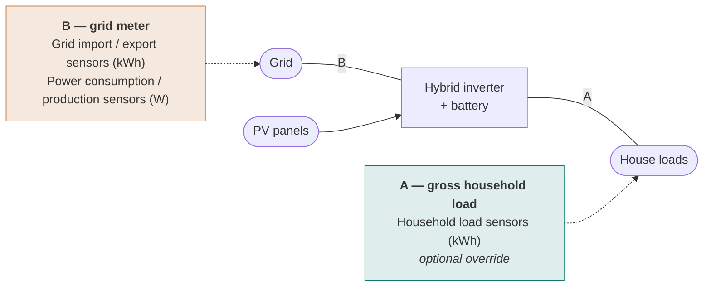
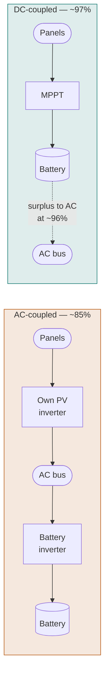

# Configuration reference

Battery Controller is configured in three places:

1. **The main entry** — global sensors and advanced settings, in collapsible sections.
2. **Battery subentries** — one per physical battery, each with its own specs and sensors.
3. **PV array subentries** — one per array, each with its own geometry and coupling type.

All three can be changed after setup via **Settings → Devices & Services → Battery
Controller → Configure**. A handful of runtime tuning knobs are exposed as
[number entities](entities.md#number-entities) instead, so you can change them from an
automation.

---

## Main entry

### Sensors (required)

| Parameter | Description |
|-----------|-------------|
| Electricity price sensor | Price sensor with forecast attributes. See [verifying your price sensor](installation.md#verifying-your-price-sensor). |

### Optional sensors

| Parameter | Description |
|-----------|-------------|
| Feed-in price sensor | Separate feed-in/export price sensor. When absent, **Fixed feed-in price** is used. |
| Power consumption sensors | Real-time grid **import** power sensors (W), for zero-grid control |
| Power production sensors | Real-time grid **export** power sensors (W), for zero-grid control |
| Grid import sensors | Cumulative kWh drawn from the grid |
| Grid export sensors | Cumulative kWh fed back to the grid |
| PV production sensors | Cumulative kWh from PV inverters |
| Household load sensors | Cumulative kWh of gross household load — optional override, see below |

### Where each sensor sits



If the house draws 3 kW while the battery charges at 4 kW, then **A** reads 3 kW and
**B** reads 7 kW. Most people only have **B**, which is why household load is derived
rather than asked for.

!!! info "Household load is derived, not configured"
    The pattern learner needs **gross household load** — everything the house draws, no
    matter whether it came from the grid, PV or the battery. You do not configure that
    figure. You configure the physical meters, and it is derived:

    ```
    gross = import − export + PV + discharge − charge
    ```

    | Field | Sensor |
    |-------|--------|
    | Grid import sensors (kWh) | P1 / DSMR import |
    | Grid export sensors (kWh) | P1 / DSMR export |
    | PV production sensors (kWh) | your inverter's total production |
    | Battery charged / discharged | on each **battery subentry** |

    Every term matters. Drop export and the PV that went out to the grid is counted as
    consumption the house never drew — on a sunny hour with 4 kWh of PV and a house
    drawing 1 kWh, that reports 4 kWh instead of 1. Drop the battery counters and every
    kWh charged from the grid is learned as household load; since the optimizer chooses
    when to charge, the model would partly be learning its own past decisions. A warning
    is logged for each missing term.

    Without PV sensors the integration falls back to its own PV forecast history, which
    is less accurate than a real meter.

!!! tip "If you have a meter between the inverter and the house"
    Then use **Household load sensors (kWh)** instead and leave the rest of the
    calculation to it — when set, the derivation above is skipped entirely.

    It is more accurate, because it does not accumulate the error of several meters, and
    sometimes it is the only workable source: with DC-coupled PV and no DC-side counter,
    production that went straight from the panels to the house appears in no term of the
    identity at all, so the derived figure comes out too low.

!!! danger "Do not confuse the kWh fields with the W fields"
    **Power consumption sensors (W)** must be your **grid meter**, positive = import. It
    feeds only the real-time zero-grid controller, which regulates the grid toward zero.
    *Power production sensors* is the export side, and stays empty if you never export.

    These are live power readings for real-time control. The kWh fields above are
    cumulative counters for pattern learning. They are not interchangeable.

### Advanced

| Parameter | Default | Range | Description |
|-----------|---------|-------|-------------|
| Fixed feed-in price | €0.04/kWh | 0–10 | Fallback feed-in price when no feed-in sensor is configured |
| Zero grid enabled | `true` | — | Enable real-time zero-grid balance control |
| Zero grid response time | 10 s | 1–300 | Expected battery response delay; limits how fast setpoints are updated |
| Max grid power | 0 kW | 0–1000 | Grid connection cap (0 = unlimited) |

!!! note "Why the feed-in price must never be missing"
    The optimizer never receives a null feed-in price. If it did, it would fall back to
    the grid price, which makes PV arbitrage look unprofitable and pushes the schedule
    towards permanent idle. The fixed fallback exists precisely to prevent that.

---

## Battery subentry

One per physical battery. The optimizer aggregates all batteries into a single virtual
battery for planning, then splits the resulting setpoint across them.

| Parameter | Default | Range | Description |
|-----------|---------|-------|-------------|
| Name | — | — | Display name for this battery (optional) |
| Capacity (kWh) | 10.0 | 0.1–1000 | Total battery capacity |
| Max charge power (kW) | 5.0 | 0.1–1000 | Maximum charge rate |
| Max discharge power (kW) | 5.0 | 0.1–1000 | Maximum discharge rate |
| Charge efficiency curve | `0.9487` | — | Flat value, or `power:efficiency` pairs. See below. |
| Discharge efficiency curve | `0.9487` | — | Flat value, or `power:efficiency` pairs. See below. |
| Min SoC (%) | 10.0 | 0–50 | Lower operating limit for optimization |
| Max SoC (%) | 90.0 | 50–100 | Upper operating limit for optimization |
| SoC sensor | — | — | State-of-charge sensor (% or kWh) — **required** |
| Power sensor | — | — | Real-time battery power sensor (W or kW), optional |
| Battery charged sensor | — | — | Cumulative kWh into this battery, for the household-load derivation |
| Battery discharged sensor | — | — | Cumulative kWh out of this battery, same purpose |
| DC PV efficiency | 0.97 | 0.01–1.0 | Efficiency of DC-coupled PV on this inverter's DC bus |
| High SoC charge threshold (%) | — | 50–100 | Above this SoC, charge power is derated (optional) |
| High SoC max charge (kW) | — | 0–1000 | Charge power ceiling above the threshold |
| Low SoC discharge threshold (%) | — | 0–50 | Below this SoC, discharge power is derated (optional) |
| Low SoC max discharge (kW) | — | 0–1000 | Discharge power ceiling below the threshold |

Min SoC must be strictly lower than max SoC; the config flow rejects the entry otherwise.

### Efficiency curves

The default `0.9487` is √0.90 — the per-direction equivalent of a 90 % round-trip
efficiency, since charge and discharge efficiency multiply to give the round trip.

A flat number is a poor model for most hardware. Inverters have a roughly fixed idle
loss, so at low power that loss is paid out of a small flow and efficiency collapses. To
model this, enter `power:efficiency` pairs in kW instead:

```text
0.1:0.73, 0.5:0.91, 5:0.95
```

This matters more than it looks: a battery that is 95 % efficient at 5 kW but 73 % at
100 W will lose money on a trade the optimizer thinks is profitable, if the flat number
is used.

!!! tip "Ready-to-paste curves for real hardware"
    [Efficiency curves](efficiency-curves.md) collects lab-measured curves for installed
    hybrid systems (KOSTAL, FRONIUS, SMA, FOX ESS, RCT, SAX, ENERGY DEPOT, BYD) and
    owner-measured curves for the plug-in batteries common on the Dutch market (Marstek,
    Zendure, HomeWizard) — plus a method for deriving your own if yours is not listed.

### SoC-dependent power derating

Many batteries taper charge power near the top of the SoC range and discharge power near
the bottom. If you leave the four derating fields empty, the optimizer assumes full power
across the whole range and will plan trades your hardware cannot actually execute at the
scheduled rate.

For example, a battery that tapers to 1.5 kW above 85 % SoC:

| Field | Value |
|-------|-------|
| High SoC charge threshold | `85` |
| High SoC max charge | `1.5` |

---

## PV array subentry

One per array. Add several if your roof has multiple orientations.

| Parameter | Default | Range | Description |
|-----------|---------|-------|-------------|
| Name | — | — | Display name for this array (optional) |
| Peak power (kWp) | 1.0 | ≥ 0.01 | Array peak output |
| Orientation (°) | 180 | 0–360 | Compass bearing: 0 = north, 90 = east, 180 = south, 270 = west |
| Tilt (°) | 35 | 0–90 | Panel tilt from horizontal (0 = flat) |
| Efficiency factor | 0.85 | 0.01–1.0 | Derating for shading, soiling and inverter losses (AC-coupled) |
| DC-coupled | `false` | — | Enable if this array sits on the battery inverter's DC bus |
| PV forecast sensors | — | — | Forecast sensors from a PV forecast integration; override the internal model for the hours they cover |

### AC-coupled versus DC-coupled

This is not a cosmetic setting — it changes the efficiency path in the cost function.

| | Path | Typical efficiency |
|---|---|---|
| **AC-coupled** | Panels → own inverter → AC → battery inverter → battery | ~85 % |
| **DC-coupled** | Panels → MPPT → battery DC bus | ~97 % |



DC-coupled surplus that exceeds what the battery can absorb is passed to AC at ~96 %.
Set **DC-coupled** only for arrays physically wired to the battery inverter's DC input —
a hybrid inverter setup. If in doubt, leave it off.

### Using Solcast or another PV forecast integration

Instead of the built-in radiation-based model, each PV array can read its forecast from
external forecast sensors.

For the [Solcast integration](https://github.com/BJReplay/ha-solcast-solar), select both
the **Forecast Today** and **Forecast Tomorrow** sensors so the full optimization horizon
is covered. The integration reads the `detailedForecast` attribute (30-minute
`pv_estimate` values in kW) at its native resolution: each 30-minute Solcast period maps
directly onto the two 15-minute forecast steps it covers.

Also supported:

- [Volcast](https://volcast.app/) — `detailedHourly`/`detailedForecast` with
  `power_kw`/`power_w` values, including its 5-minute data, which is averaged per step
- Sensors exposing a generic `forecast` attribute (`period_start`/`datetime` plus
  `pv_estimate`/`watts`)
- Forecast.Solar-style `watts` mappings

!!! note "Still configure the geometry"
    Steps not covered by the sensor data — and any update where the sensors are
    unavailable — fall back to the internal radiation-based model. Orientation, tilt and
    peak power should therefore always be set correctly, even when using Solcast.

---

## Runtime tuning (number entities)

These are not in the config flow. They are number entities, so you can change them from
the UI or an automation without reloading the integration.

| Entity | Range | Default | Description |
|--------|-------|---------|-------------|
| Degradation Cost | 0–1.00 EUR/cycle | 0.04 | Battery wear cost per full charge+discharge cycle; part of the optimizer's cost function |
| Minimum Price Spread | 0–0.50 EUR/kWh | 0.05 | Minimum buy/sell spread required before arbitrage is scheduled |
| Zero Grid Deadband | 0–500 W | 50 | Grid power tolerance; setpoints are not updated within this band |
| Manual Power Setpoint | ±max power W | 0 | Target power in `manual` mode (positive = discharge, negative = charge) |

Degradation cost and minimum price spread together set the profitability bar. A trade is
only scheduled when the price spread exceeds roughly
`(2 × degradation + min_price_spread) / √RTE`. Raising either one makes the optimizer
more conservative; setting both to zero makes it trade on any spread at all, including
ones that cost you money in wear.
