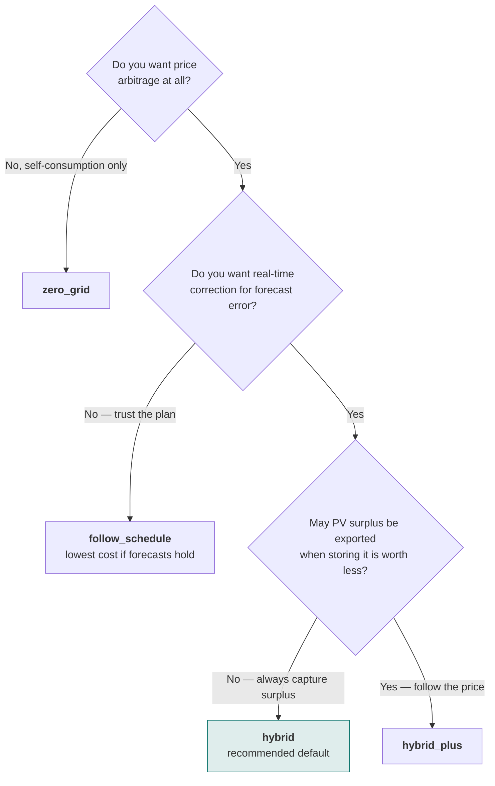

# Control modes

The control mode decides *what the published setpoint is based on*: the DP schedule, the
live grid meter, or a mix of both. Change it with the **Control Mode** select entity, or
from an automation.

The default is **Hybrid**.

## Which one should I use?

| Mode | Follows the DP schedule | Reacts to the live meter | Use when |
|------|------------------------|--------------------------|----------|
| `zero_grid` | no | yes | You only care about self-consumption, not arbitrage |
| `follow_schedule` | exactly | no | You want the strictly cost-optimal plan |
| `hybrid` | for arbitrage | for self-consumption | **Recommended default** — robust to forecast error |
| `hybrid_plus` | for arbitrage | price-aware self-consumption | You want Hybrid, but not at the cost of exporting surplus that is worth more now |
| `manual` | no | no | Testing, or driving the battery from your own logic |



`manual` is deliberately not in the tree — use it for testing, or when your own logic
drives the battery and you only want the optimizer's numbers for reference.

---

## Zero Grid

Minimize grid exchange in real time using the battery. The optimizer still runs and still
publishes its schedule, but the controller ignores it: the setpoint follows the measured
grid power, updated every **Zero Grid Response Time** seconds.

No arbitrage happens in this mode. It is self-consumption only.

**How the setpoint converges.** Each tick moves the setpoint by half of the remaining
grid error rather than all of it:

```
target = last_target − 0.5 × grid_power
```

The half-step matters. At full step the loop only settles if the meter already reflects
the setpoint issued on the previous tick. One tick of delay — an inverter still ramping,
or a meter polled on its own cycle — puts the loop exactly on the stability boundary, and
it oscillates forever: against a steady 2 kW load it swung between 0 and −4 kW with a
period of six ticks, and with two ticks of delay between −5 kW and +4 kW. The deadband
cannot damp that, because the swings are far larger than it.

The cost is a slightly slower response: a step change in load is compensated to within
5 % after about 4 ticks (40 s at the default 10 s interval) instead of 1. If your setup
responds quickly, lower **Zero Grid Response Time** rather than looking for a gain knob.

## Follow Schedule

Execute the DP-optimized schedule exactly.

When the commitment filter keeps an active charge/discharge locked within the same price
period, that lock applies to the published controller setpoint too, not just to the
diagnostic `optimal_power` value. So the setpoint can stay put while `optimal_power`
would suggest a change — this is deliberate, and prevents chattering inside a period.

This is the mode that produces the lowest cost *if your forecasts are correct*. It has no
real-time correction, so a consumption spike the forecast did not anticipate is simply
imported from the grid.

!!! warning "No real-time correction once import and export are priced separately"
    Follow Schedule executes the planned **battery power**. The optimizer's cost model
    prices the **grid exchange** that this power was expected to produce — so when the
    forecast is wrong, the realised cost is not the planned one.

    The meter has separate registers for import and export, and they simply accumulate:
    nothing is ever netted between them. While a netting arrangement applies at billing
    time this does not matter, but once each direction is billed at its own price, every
    exported Wh that you later import back costs you the spread.

    The optimizer handles that trade-off *between* time steps — storing surplus versus
    exporting it is its core decision. What it cannot see is variation *within* one step:
    `calculate_step_cost` prices the net exchange over the whole step, so a sub-step swing
    that changes direction is invisible to it. A passing cloud exports a few minutes of
    surplus at the feed-in price and imports it back minutes later at the full retail
    price; the step's net looks unchanged. The window here is the optimizer's own time
    step — the resolution of your price sensor, 15 or 60 minutes — not any billing
    interval. Steady periods, and periods with a firmly one-directional plan, are
    unaffected.

    Exposure is largest when the planned grid flow is near zero — a planned `idle` with
    PV roughly matching consumption, or a discharge sized to cover the house.
    [Hybrid](#hybrid-recommended) and [Hybrid+](#hybrid) avoid this: they hand those
    periods to zero-grid, which regulates the meter to ~0 continuously.

    Choose Follow Schedule when you want a predictable setpoint — for instance when your
    own automations build on it. Choose Hybrid when you want the cheapest realised bill.

## Hybrid (recommended)

DP schedule for arbitrage, zero-grid for self-consumption.

When the DP schedule says `idle` and no discharge is planned soon, Hybrid still
opportunistically captures PV surplus into the battery via zero-grid — **even if the
feed-in price is currently positive and exporting that surplus would be more
profitable**.

That is a deliberate trade: a small amount of arbitrage profit is given up in exchange
for resilience. Keeping headroom filled means the battery can absorb real-time
consumption spikes — a cloud passing over the panels while a large appliance switches on
— instead of pulling from the grid.

The one exception is a **vetoed discharge**. When the DP plans to discharge but the
shadow price says the energy is worth more later than the current feed-in price pays,
Hybrid overrules the plan and holds. That veto is a decision to keep energy, so it does
not fall through to zero-grid unless storing the surplus also beats exporting it
(`λ × charge_eff ≥ feed-in`) — otherwise the mode that just refused to sell at the
feed-in price would immediately buy PV surplus at that same price. Both Hybrid and
Hybrid+ apply this test; Hybrid's unconditional surplus capture applies where the DP has
no opinion, not where it is overruling an explicit plan.

A **planned charge** is arbitrated the same way. The DP plans it against forecast PV, so
when the sun under-delivers, following the plan verbatim means buying the difference from
the grid. Hybrid checks whether that is worth it: a stored kWh costs `price / charge_eff`
plus degradation, and buying it is justified only while the shadow price covers that
(±5 % hysteresis). Planned grid arbitrage — a cheap hour the DP deliberately charges in —
passes that test and runs at full power. A charge planned against PV that failed to
arrive does not: the mode then charges on whatever surplus there is (zero-grid), or holds
at idle when there is none, and lets the DP charge later when the sun or a cheaper hour
delivers. Both Hybrid and Hybrid+ apply this test.

Every one of these decisions reads the PV surplus as `battery − grid`, not as the meter
reading. The meter includes what the battery itself is doing, so a charge that is
importing looks like "no surplus" and a zero-grid capture holding the meter at 0 W looks
the same whether the sun is still shining or not. Measured against the battery's own
action, the surplus stays visible and the arbitration keeps working while it acts on it.

!!! info "Hybrid is recommended for robustness, not for maximum arbitrage profit"
    If you want surplus capture to follow the price forecast instead, use **Hybrid+**.
    For the strictly cost-optimal schedule with no opportunistic charging at all, use
    **Follow Schedule**.

!!! note "Response time"
    The charge arbitration is re-checked on every real-time tick (the zero-grid response
    time, ~5-10 s), not only when the optimizer runs. A charge that starts importing
    because a forecast did not hold is released within seconds instead of at the end of
    the price period.

## Hybrid+

Like Hybrid, but consults the price forecast before storing PV surplus.

When the shadow price says the battery can be filled more cheaply later — for example
during a midday PV peak at low prices — the surplus is exported at the current feed-in
price instead of charged, and the battery charges later from the cheaper surplus.

When little future surplus is forecast, stored energy stays valuable (it displaces grid
import, or serves expensive evening hours), so the surplus is captured immediately —
identical to Hybrid.

In short: **exporting only wins when the battery would fill up anyway, or when the stored
energy has little future value.**

## Manual

Target power is set via `number.battery_controller_manual_power_setpoint`.

Positive is discharge, negative is charge. The optimizer keeps running and its sensors
keep updating, so you can compare your own logic against what the DP would have done.

---

## A note on mode and SoC drift

Hybrid and Hybrid+ can diverge from the DP plan whenever zero-grid takes over. The
optimizer notices this on the next run: the actual SoC no longer matches what the
previous plan assumed, and because the whole horizon is re-solved from scratch, the new
plan can look meaningfully different.

That is expected behaviour, not a bug — see [the learning
period](how-it-works.md#learning-period-give-the-optimizer-time-to-calibrate) for why
rolling-horizon DP behaves this way.

Next: [connecting your inverter](inverter-control.md).
