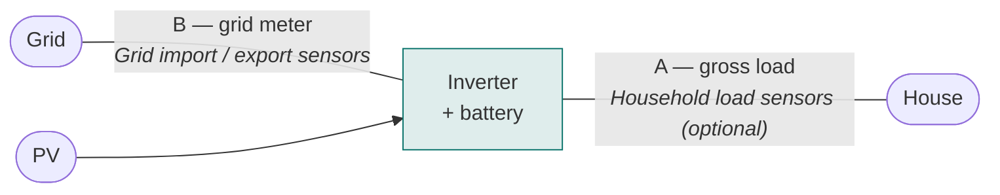

# Frequently asked questions

These are the questions that have actually come up in
[the issue tracker](https://github.com/bvweerd/battery_controller/issues), with the
answers collected in one place.

---

## Modes and scheduling

### My inverter cannot export to the grid. Should I use Zero Grid or Hybrid?

**Hybrid.**

Zero-grid only does real-time self-consumption. It never charges from the grid in cheap
hours — so you would lose the arbitrage that is usually the whole reason for switching to
a dynamic contract. Hybrid does both: the DP charges from the grid in cheap hours, and
zero-grid handles self-consumption the rest of the time.

For a no-export setup:

- Set **Max grid power** to your contractual limit (e.g. 7 kW).
- Keep the feed-in price at or near 0, so the DP never plans an export.
- Leave **Power production sensors** empty.
- If your PV is on the inverter's DC bus, add the arrays as subentries and tick
  **DC-coupled** — the forecast then plans grid charging around your own production.

### Does `discharging` mean "export to the grid"?

No. This is the most common misreading of the mode sensor.

`discharging` means the DP wants the battery to **deliver power** during an expensive
period. In a house that consumes anything at all, that power serves your own loads and
displaces expensive import. Export only happens if the battery delivers more than the
house is using *and* your system is allowed to export.

The four modes:

| Mode | Meaning |
|------|---------|
| `idle` | The battery neither charges nor discharges; loads are served from grid and PV |
| `charging` | The battery is being charged (from cheap grid power, PV surplus, or both) |
| `discharging` | The battery delivers power in an expensive period — normally into your own loads |
| `zero_grid` | Real-time control has taken over: the battery is regulating grid exchange toward zero |

### Will it hurt the predictions if I charge at max power instead of following the setpoint?

No. The optimizer re-solves from the **actual SoC** on every run, and its feedback comes
from the SoC sensor, not from the battery power sensor. Charge faster and the next run
simply re-plans from the higher SoC.

The cost is purely economic: charging flat-out can run into the pricier minutes of a
window and overshoot the target SoC. Starting on `optimal_mode = charging` and stopping
when it leaves that mode keeps the loss small. For a fully optimal result, drive charge
power from `sensor.battery_controller_battery_setpoint`, which is already capped to your
**Max grid power**.

### Why does the schedule change between two runs a few minutes apart?

Because every run re-solves the entire 24–36 hour horizon from scratch, rather than
patching the previous plan. A small change in the price forecast, PV forecast or actual
SoC can shift how much capacity gets allocated to the current window versus a later one.

This is expected rolling-horizon DP behaviour. See
[the learning period](how-it-works.md#learning-period-give-the-optimizer-time-to-calibrate).

### Why does it not re-optimize every few seconds?

Two reasons, and the first is the surprising one.

Within a price period the prices and the forecasts do not change. The only thing that could
flip a decision between two ticks is the shadow price moving as the battery fills or
empties — and it barely moves. The value function is piecewise linear in SoC, so the
[shadow price](glossary.md) is piecewise *constant*, flat over most of the range.
Re-evaluating it every five seconds returns the answer it returned fifteen minutes ago.

The second is cost. A full solve takes roughly twenty seconds on a fast machine and runs
four times an hour. Running it every five seconds is about a hundred and eighty times the
processing, and not even possible, since a single solve outlasts the interval. Shortening
the horizon scales down proportionally, but a one-hour horizon still costs several times
the entire current optimizer — and it cannot see tomorrow evening, so its shadow price
would be a worse signal than the one already published.

Real-time correction is handled by the zero-grid controller instead, which runs every few
seconds and needs no optimization at all.

### The optimizer stopped charging during what looked like the most profitable window

Usually one of three things:

1. The **SoC ceiling** was reached — check **Max SoC** in the battery subentry.
2. The DP found a *better* window later in the horizon and is reserving capacity for it.
   Capacity is finite; the cheapest hour is not always the one worth using.
3. The spread no longer cleared the profitability bar after degradation cost and
   efficiency losses — see [runtime tuning](configuration.md#runtime-tuning-number-entities).

Upload your diagnostics to the [analyzer](analyzer/index.html); it explains every
individual charge and discharge decision, including the ones it declined to make.

---

## Sensors and forecasts

### Where do I put my P1 meter, and why is there no "consumption" field?

Your P1 import and export go in **Grid import sensors** and **Grid export sensors** (kWh)
for pattern learning, and in **Power consumption / production sensors** (W) for real-time
control. Same meter, two fields, because one is a cumulative counter and the other a live
reading.

There is no consumption field because household load is derived, not configured:

```
gross = import − export + PV + discharge − charge
```

| Field | Unit | What it must measure |
|-------|------|----------------------|
| Grid import / export sensors | kWh, cumulative | Your P1 registers |
| PV production sensors | kWh, cumulative | Inverter total production |
| Battery charged / discharged | kWh, cumulative | Per battery subentry |
| Power consumption / production sensors | W, live | Grid meter, for zero-grid control |
| Household load sensors | kWh, cumulative | *Optional override* — only if you have a meter between inverter and house |



If you do have a meter at **A** — between the inverter and the house — put it in
*Household load sensors* and the derivation is skipped entirely. That is more accurate,
and it is the only workable route when a term cannot be measured, such as DC-coupled PV
with no DC-side counter.

### My consumption forecast is far too low

Almost always this means **no consumption pattern has been learned yet**, so the forecast
is still the built-in cold-start curve (~0.4–0.6 kW, shaped for a ≈3500 kWh/year
household). It is not a scaling problem.

See [the troubleshooting entry](troubleshooting.md#the-consumption-forecast-is-far-too-low)
for how to diagnose it. Note in particular that **waiting does not help** — the pattern is
learned from the past 14 days of your sensor's recorder history, not from how long the
integration has been running.

### My PV Forecast sensor shows a flat zero, but I do have solar

If all your arrays are **DC-coupled**, this is expected. The `PV Forecast` sensor reports
the AC-coupled series; DC-coupled production is forecast separately because it takes a
different efficiency path (~97 % via MPPT, versus ~85 % through a separate inverter).

The analyzer reports the DC total explicitly and accounts for it in the net line. If
*both* series are zero across the whole horizon, that points at array configuration or
the weather coordinator instead.

### What does "Net Grid Forecast" actually mean?

Expected grid exchange **without the battery**: `consumption − PV`. Negative means you
would be exporting. It is the baseline the optimizer compares its plan against, which is
also how **Estimated Savings** is computed.

### My prices are in €/MWh, do I need a template sensor to convert them?

No. The integration reads the sensor's `unit_of_measurement` and converts to €/kWh
automatically, and the self-learning price model applies the same conversion to
historical recorder data. Point the price sensor field straight at your source sensor.

This is the case for [OMIE](https://github.com/luuuis/hass_omie) (Spain/Portugal), whose
quarter-hourly data is also detected and used at its native 15-minute resolution.

### The forecast coordinator finished in 0.001 s — did it skip something?

No. The forecast coordinator is arithmetic over arrays, so milliseconds are normal. The
expensive step is the **optimization** coordinator, which runs the DP itself and typically
takes seconds. Look for the `Finished fetching Battery Controller Optimization data` line
in the debug log to see that timing.

---

## Control and hardware

### Which sensor should my automation read?

`sensor.battery_controller_battery_setpoint`. Not `optimal_power` — that is the
optimizer's diagnostic recommendation, and it can legitimately differ from what should
actually be sent to the inverter. See [connecting your inverter](inverter-control.md).

### The battery setpoint stayed positive all night while the mode said discharging

Positive **is** discharge, for every power sensor the integration creates. The
configured input sensor uses the opposite convention. That mismatch is deliberate but
confusing enough that it deserves checking twice — see
[sign conventions](inverter-control.md#sign-conventions).

### The mode flips rapidly between idle, charging and zero_grid

Hysteresis around the zero-crossing and surplus-coverage decisions was added after
[#81](https://github.com/bvweerd/battery_controller/issues/81). If you still see churn on
a current version, raise the **Zero Grid Deadband** so ordinary sensor noise no longer
crosses the threshold, and check that your grid power sensor is not itself noisy.

### Can I run this with multiple inverters and one big battery bank?

Yes. Add one battery subentry per physical battery. The optimizer aggregates them into a
single virtual battery for planning and splits the resulting setpoint proportionally —
by available headroom when charging, by stored energy when discharging.

---

## Still stuck?

Download diagnostics via **Settings → Devices & Services → Battery Controller →
three-dot menu → Download diagnostics** and upload the file to the
[analyzer](analyzer/index.html). It re-runs the optimizer on your own data and flags
configuration problems — an empty consumption pattern, an all-DC PV setup, an SoC ceiling
that blocked a trade — directly in the report.

If that does not answer it,
[open an issue](https://github.com/bvweerd/battery_controller/issues) and attach the
diagnostics file.
