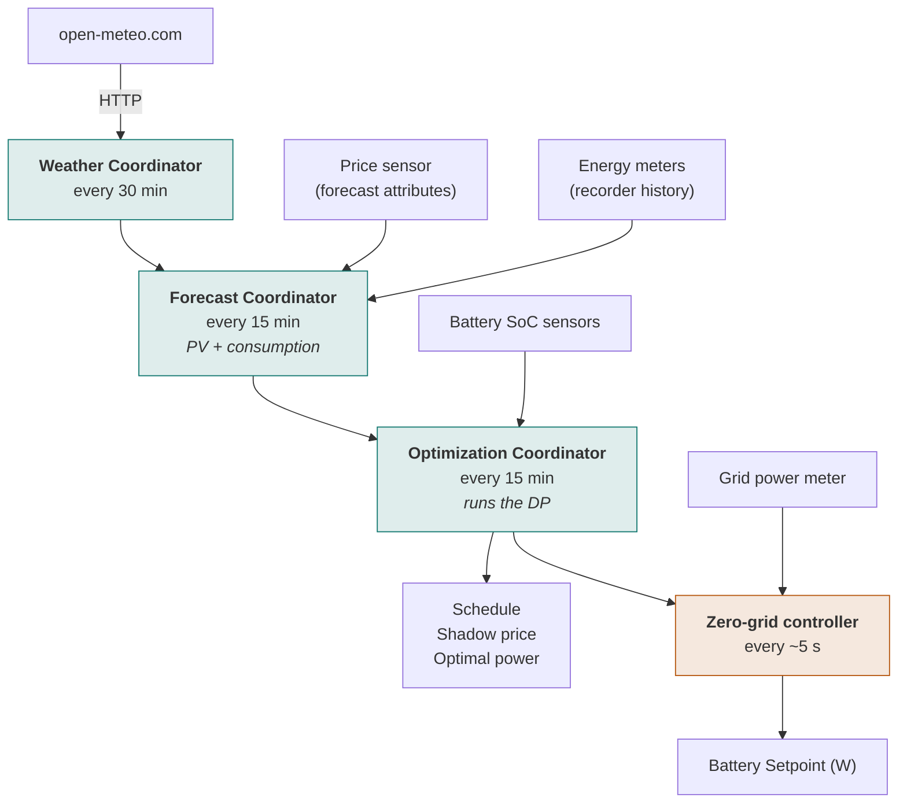
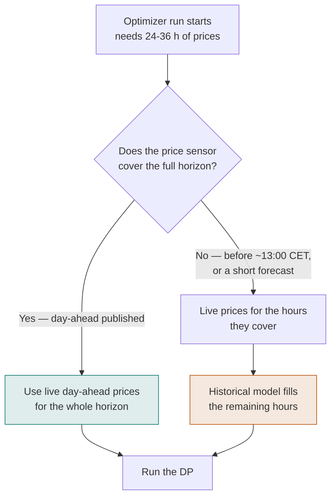

# How it works

This page describes the moving parts and their timing. For the mathematics of the
optimizer itself — the Bellman equation, the cost function, the terminal condition — see
[the algorithm page](algorithm.md).

---

## Architecture

The integration runs three cascading coordinators, each feeding the next:

| Coordinator | Interval | Reads | Produces |
|-------------|----------|-------|----------|
| **Weather** | 30 min | open-meteo.com | Solar radiation (GHI) + wind speed forecast |
| **Forecast** | 15 min | Weather, price sensor, energy meters | PV production + consumption forecast |
| **Optimization** | 15 min | Forecast, SoC sensors | DP schedule, shadow price, setpoint |

The zero-grid controller runs separately at roughly **5-second** resolution — it reacts to
the live grid meter, not to the forecast. That is the loop responsible for the
`zero_grid` mode and for the real-time part of the hybrid modes.

!!! note "The optimizer does not only run on the 15-minute clock"
    It also re-runs immediately when:

    - a new price period starts
    - there is a significant price change
    - a stale price or SoC sensor becomes available again
    - the midpoint of the current price period is reached (a scheduled "mid-period
      correction" run)

    Every run re-solves the **entire** rolling horizon from scratch, so two schedule
    snapshots taken a few minutes apart can look meaningfully different. See
    [the learning period](#learning-period-give-the-optimizer-time-to-calibrate) below.

### Subentry structure

Battery Controller uses **subentries** to manage hardware flexibly:

- **Battery subentries** — each with its own capacity, power limits, SoC sensor, and
  optional power sensor.
- **PV array subentries** — each with its own peak power, orientation, tilt, and coupling
  type.

The optimizer aggregates all battery subentries into a single virtual battery for
planning. When executing the schedule, the required power is split across the physical
batteries proportional to their available headroom (charging) or stored energy
(discharging).

---

## Historical price model (pre-day-ahead fallback)

Day-ahead electricity prices (Nordpool, ENTSO-E) are published around **13:00 CET**.
Before that, the integration uses a **self-learning historical price model** so the
optimizer can still run on a reasonable forecast.

The same model **extends the planning horizon** when live prices cover less than 24 hours.
It builds lookup tables from data in the Home Assistant recorder, keyed on:

- hour of day
- weekday
- solar irradiance (GHI)
- wind speed

The last two matter because both push wholesale prices down when supply is high — which
is why enabling the Solar Irradiance and Wind Speed diagnostic sensors early gives the
model more to learn from.

---

## Learning period: give the optimizer time to calibrate

!!! warning "Allow at least 2–4 weeks of operation before judging performance"

The optimizer uses **rolling-horizon dynamic programming**: on *every* run it re-solves
the entire planning horizon (24–36 hours) from scratch, starting from the current SoC.
The value of stored energy at the end of the horizon — the terminal condition — is set
from the price forecast itself (a clipped tail-average of the feed-in price), not carried
over from the previous run.

Because battery capacity is limited, this is a **global allocation problem**: the DP
weighs using the current cheap or negative-price window *now* against reserving capacity
for a better opportunity later in the horizon. On a rerun, small input changes can shift
that trade-off enough to visibly change today's plan:

- A price forecast update — day-ahead prices publishing, a revised historical-model
  estimate, or simply a new period starting.
- An updated PV or consumption forecast.
- The actual SoC drifting from what the previous plan assumed — for example because
  [Hybrid mode](control-modes.md#hybrid-recommended) diverged to zero-grid instead of
  following the DP schedule exactly.

Because the whole horizon is re-optimized rather than patched incrementally, even a
modest change in one input can shift how much capacity is allocated to the current window
versus a later one. **Two runs a few minutes apart can show different schedules for what
looks like the same situation. This is expected DP behaviour, not a bug.**

### Why it is most visible in the first weeks

Two data-driven models are still building up from recorder history:

- The **household consumption pattern** and **historical price model** need time to learn
  typical usage and price patterns.
- The **shadow price** (λ) — the marginal value of storage, used by Hybrid mode as its
  charge/discharge threshold — is noisier while the forecasts feeding it are inaccurate.

During this convergence period you may notice:

- The schedule changing more noticeably between runs, including between two runs within
  the same 15-minute slot.
- The optimizer occasionally charging or discharging more aggressively than expected.
- Estimated savings that appear lower than the long-run optimum.

The longer the integration runs, the more accurate the underlying forecasts become and
the more stable the resulting schedule.

---

## Known limitations

- **Optimization horizon** — the DP optimizer uses a rolling 24–36 hour horizon. Decisions
  near the end of the horizon depend on the shadow price rather than explicit future
  prices. The shadow price converges over several days of operation.
- **Price forecast dependency** — the optimizer requires a price sensor with forecast
  attributes. Without future prices only the historical model is used, which reduces
  arbitrage accuracy.
- **Day-ahead gap** — before day-ahead prices publish (around 13:00 CET), the schedule
  rests on the historical model and may be less optimal.
- **Single aggregate battery** — multiple batteries are aggregated into one virtual
  battery for optimization, then split proportionally. Batteries with very different
  chemistries or SoC ranges may not be split optimally.
- **LFP assumptions** — the efficiency model assumes flat efficiency across the SoC range,
  as is typical for LFP cells. Chemistries with significant SoC-dependent efficiency
  variation are not modelled.
- **No direct hardware communication** — Battery Controller writes setpoints to Home
  Assistant entities only. Connecting these to your inverter is
  [your automation's job](inverter-control.md).
- **Consumption pattern learning** — the consumption model needs several weeks of kWh
  sensor history for accurate patterns. Forecasts are less accurate during the initial
  period.
