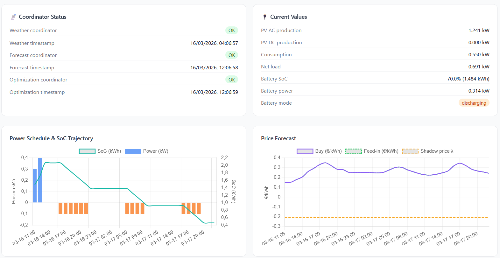
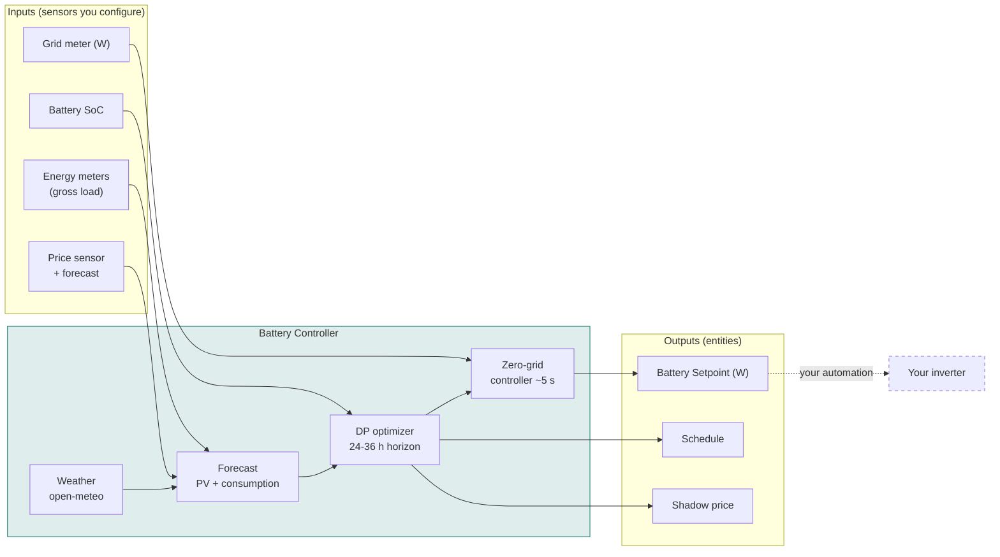
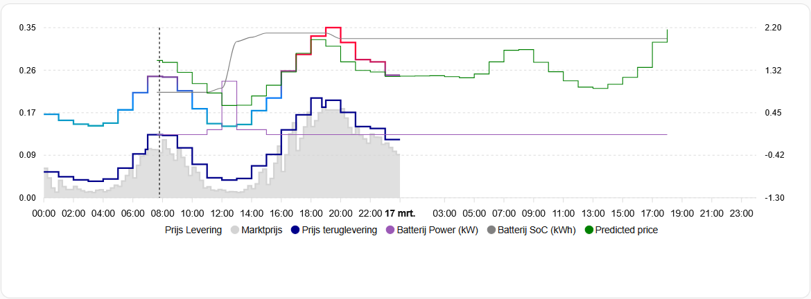

# Battery Controller

**Home battery cost optimization for Home Assistant.**

Battery Controller is a Home Assistant custom integration that works out *when* your
home battery should charge and discharge so your electricity bill is as low as possible.
It solves the whole planning horizon with **dynamic programming** rather than reacting to
the current price, so it can hold capacity back for a better opportunity later in the day.

!!! warning "This integration is aimed at technically experienced users"
    It requires setting up and tuning a number of parameters (efficiency, degradation
    costs, price sensors, control mode) and connecting it to your inverter via
    automations. Incorrect configuration will not damage your battery, but may result in
    suboptimal scheduling or no control at all. If you are not comfortable reading
    diagnostics data and interpreting optimizer output, this integration may not be the
    right fit — yet.

---

## Analyze your own setup

[:material-chart-box: **Open the Diagnostics Analyzer**](analyzer/index.html){ .md-button .md-button--primary }

Upload your `diagnostics.json` for a full breakdown of your configuration, optimizer
schedule, profitability analysis, and improvement tips — no installation required. The
analyzer runs entirely in your browser: nothing is uploaded to a server. It visualizes
the current schedule, re-runs the DP optimizer with your data, and explains every
charge/discharge decision.

To generate a diagnostics file: **Settings → Devices & Services → Battery Controller →
three-dot menu → Download diagnostics**.

---

## Start here

-   :material-download: **[Installation](installation.md)**

    Prerequisites, verifying your price and consumption sensors, HACS setup.

-   :material-tune: **[Configuration reference](configuration.md)**

    Every option in the main entry, battery subentries and PV array subentries.

-   :material-swap-horizontal: **[Control modes](control-modes.md)**

    Zero-grid, follow-schedule, hybrid, hybrid+ and manual — and which to pick.

-   :material-power-plug: **[Connecting your inverter](inverter-control.md)**

    Which sensor to read, sign conventions, and a working example automation.

-   :material-function-variant: **[How it works](how-it-works.md)**

    The coordinator cascade, the historical price model, and the learning period.

-   :material-frequently-asked-questions: **[FAQ](faq.md)**

    Real questions from the issue tracker: modes, sensors, signs, forecasts.

-   :material-lifebuoy: **[Troubleshooting](troubleshooting.md)**

    What to check when nothing is scheduled, or the forecast looks wrong.

---

## What it optimizes on

The schedule is calculated from:

- **Electricity price forecasts** — Nordpool, ENTSO-E, OMIE, or any price sensor with
  forecast attributes such as the
  [Dynamic Energy Contract Calculator](https://github.com/bvweerd/dynamic_energy_contract_calculator)
- **PV production forecasts** — from open-meteo.com solar radiation data, or from a PV
  forecast integration such as [Solcast](https://github.com/BJReplay/ha-solcast-solar)
- **Household consumption patterns** — learned from your historical energy meter data
- **Battery characteristics** — capacity, power limits, round-trip efficiency, degradation
- **A historical price model** — fallback and horizon extension for when day-ahead prices
  are not yet published

Battery Controller works with any battery inverter and electricity meter. It is a
*calculated* integration that reads sensors and writes setpoints — it does not
communicate directly with hardware. Connecting the setpoint to your inverter is your
job, via an automation.

The dashed arrow is the part you build yourself — see
[connecting your inverter](inverter-control.md).

### Key features

- **Price arbitrage** — charge during cheap hours, discharge during expensive hours
- **Multi-battery support** — multiple batteries with independent sensors, treated as one
  aggregate while setpoints are distributed proportionally
- **Multi-array PV** — any number of arrays with independent orientation and tilt
- **Pre-day-ahead price model** — optimize before day-ahead prices are published
  (typically before 13:00 CET) using a self-learning historical model
- **Horizon extension** — when live prices cover less than 24 hours, the remainder is
  filled from the historical model automatically
- **PV self-consumption** — maximize use of solar energy, minimize feed-in
- **DC-coupled PV support** — higher efficiency for panels directly on the battery
  inverter's DC bus (hybrid inverters)
- **Zero-grid control** — real-time battery control to minimize grid exchange
- **Degradation-aware** — battery wear is part of the cost function
- **Multiple control modes** — zero-grid, follow schedule, hybrid, hybrid+, or manual
- **Negative price handling** — suggests PV curtailment or maximum power consumption
  during negative prices

---

## License

Battery Controller is released under the Apache License 2.0. See
[LICENSE](https://github.com/bvweerd/battery_controller/blob/dev/LICENSE) for details.
