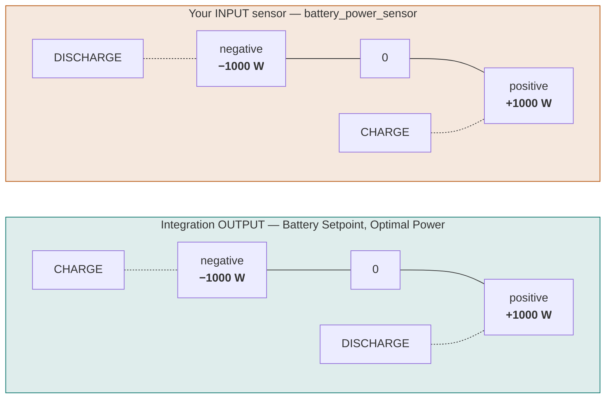
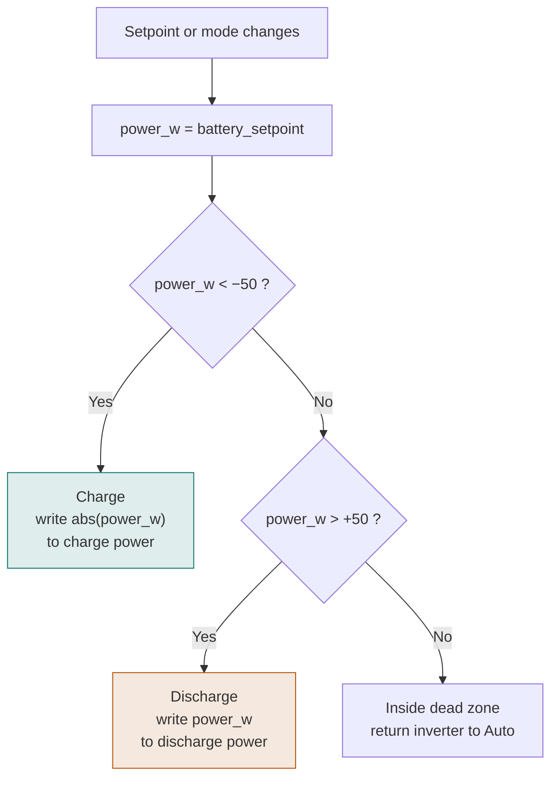

# Connecting your inverter

Battery Controller does not talk to hardware. It reads sensors and publishes a setpoint;
**an automation you write** turns that setpoint into commands for your inverter.

This page covers the three things that go wrong most often: reading the wrong sensor,
getting the sign backwards, and writing setpoints faster than the inverter can follow.

---

## Which sensor to read

Read **`sensor.battery_controller_battery_setpoint`** (in W). That is the published
controller target, in every control mode.

| Control mode | Optimal Mode values | Sensor to use |
|--------------|---------------------|---------------|
| `follow_schedule` | `charging` / `discharging` | `sensor.battery_controller_battery_setpoint` |
| `hybrid` / `hybrid_plus` / `zero_grid` | `charging` / `discharging` / `zero_grid` | `sensor.battery_controller_battery_setpoint` |

!!! warning "Do not drive your inverter from `optimal_power`"
    `sensor.battery_controller_optimal_power` is the **optimizer's recommendation** — a
    diagnostic value. `battery_setpoint` is the **actual published target**.

    Under normal operation they match. They diverge when the commitment filter locks a
    charge or discharge step within the same price period, and when zero-grid overrides
    the schedule in the hybrid modes. In both cases `battery_setpoint` is the one that
    reflects what should actually happen.

With multiple batteries, per-battery targets are published as
`sensor.battery_controller_battery_setpoint_<name>`, already split from the combined
setpoint in proportion to each battery's headroom (charging) or stored energy
(discharging).

---

## Sign conventions

This trips up almost everyone, because the input and output conventions are **opposite**.

| | Positive means | Negative means |
|---|---|---|
| Sensors **created by** the integration (Total Battery Power, Battery Setpoint, Optimal Power) | discharge | charge |
| The battery power sensor **you configure** as input (`battery_power_sensor`) | charge | discharge |



The input convention matches how the integration reports charge/discharge mode. If your
own battery power sensor follows the output convention instead — positive for discharge —
invert its sign with a template sensor before pointing the field at it:

```yaml
template:
  - sensor:
      - name: "Battery Power (inverted for Battery Controller)"
        unit_of_measurement: "W"
        device_class: power
        state_class: measurement
        state: "{{ 0 - (states('sensor.my_inverter_battery_power') | float(0)) }}"
```

!!! tip "How to check you got it right"
    Put the integration in `manual` mode and set **Manual Power Setpoint** to a small
    negative value, e.g. −500 W. The battery should **charge**. If it discharges, your
    automation has the sign backwards.

---

## Example automation

A minimal, inverter-agnostic pattern. Replace the `number.inverter_*` and
`select.inverter_mode` entities with whatever your inverter integration exposes.

```yaml
automation:
  - alias: "Battery Controller - Inverter Control"
    trigger:
      - platform: state
        entity_id: sensor.battery_controller_optimal_mode
      - platform: state
        entity_id: sensor.battery_controller_battery_setpoint
    action:
      - variables:
          mode: "{{ states('sensor.battery_controller_optimal_mode') }}"
          power_w: "{{ states('sensor.battery_controller_battery_setpoint') | float }}"
      - choose:
          - conditions: "{{ power_w < -50 }}" # Charging
            sequence:
              - service: number.set_value
                target: { entity_id: number.inverter_charge_power }
                data: { value: "{{ power_w | abs }}" }
          - conditions: "{{ power_w > 50 }}" # Discharging
            sequence:
              - service: number.set_value
                target: { entity_id: number.inverter_discharge_power }
                data: { value: "{{ power_w }}" }
        default:
          - service: select.select_option
            target: { entity_id: select.inverter_mode }
            data: { option: "Auto" }
```



The ±50 W dead zone around zero keeps the automation from flapping between charge and
discharge commands on tiny setpoint changes. Match it to your **Zero Grid Deadband**
setting.

---

## Practical guidance

### Write rate

In the zero-grid and hybrid modes the setpoint updates roughly every **5 seconds**. Many
inverters — particularly those behind Modbus or a cloud API — will not accept writes that
fast, and some will fault or rate-limit.

Two knobs control this:

- **Zero grid response time** (advanced setting, default 10 s) tells the controller how
  long your battery takes to respond, and limits how fast setpoints are updated.
- **Zero Grid Deadband** (number entity, default 50 W) suppresses updates for grid
  deviations smaller than the band.

If your inverter struggles, raise the response time first.

### Batteries that need an explicit mode

Some inverters ignore a power setpoint unless they are first put into a manual or
forced-charge mode. If yours behaves that way, set the mode in the same `choose` branch
that writes the power value, and return it to automatic in the `default` branch — as the
example above does with `select.inverter_mode`.

### Power limits

Set **Max charge power** and **Max discharge power** in the battery subentry to what the
hardware can actually sustain, not the nameplate peak. If the inverter tapers near the
SoC limits, also fill in the
[SoC-dependent derating fields](configuration.md#soc-dependent-power-derating) — otherwise
the optimizer plans trades at a rate your battery will not deliver, and the realized
saving falls short of the forecast.

### Grid connection cap

If your connection is limited — a small fuse, or a dynamic grid tariff with a capacity
component — set **Max grid power** in the advanced settings. The optimizer treats it as a
hard constraint rather than discovering it by tripping something.

---

## Sharing a working configuration

There is no per-brand recipe list here, because entity names differ per inverter
integration, per firmware version, and sometimes per region — a wrong recipe costs more
time than no recipe.

If you have a working automation for a specific inverter, please
[open a discussion or pull request](https://github.com/bvweerd/battery_controller/issues)
with:

- inverter make, model and the HA integration used (with a link)
- the entity IDs you write to, and their units
- whether an explicit mode change is needed before the power setpoint is accepted
- the **Zero grid response time** value that turned out to be stable
- the sign convention the inverter itself uses

Verified contributions will be collected here.
