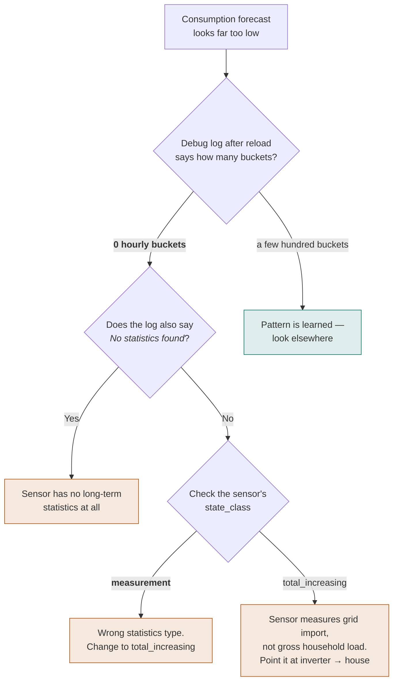

# Troubleshooting

Symptom-driven. For "how is this supposed to work" questions, see the [FAQ](faq.md).

!!! tip "Start with the analyzer"
    Download diagnostics via **Settings → Devices & Services → Battery Controller →
    three-dot menu → Download diagnostics**, then upload the file to the
    [analyzer](analyzer/index.html). It re-runs the optimizer on your own data and names
    the likely cause of most of the problems on this page — including an empty
    consumption pattern, an all-DC PV setup, and trades blocked by an SoC limit.

## Enabling debug logging

Several checks below need the debug log. Add this to `configuration.yaml` and reload:

```yaml
logger:
  logs:
    custom_components.battery_controller: debug
```

---

## No charge/discharge schedule is generated

- Check **Settings → System → Logs** for errors from `battery_controller`.
- Verify the **Optimization Status** sensor is `ok` — not `failed` or `initializing`.
- Confirm your price sensor has forecast attributes: **Developer Tools → States** → find
  your sensor → check the attributes for `raw_today`, `raw_tomorrow`, or `forecast`. See
  [verifying your price sensor](installation.md#verifying-your-price-sensor).
- Check that the **Optimization Enabled** switch is on.

## The battery is not charging or discharging as expected

- Check the **Control Mode** select entity — it must not be `manual` unless you intend
  that.
- Verify your automation reads `sensor.battery_controller_battery_setpoint`, **not**
  `optimal_power`.
- In `follow_schedule` mode, the commitment filter may be holding an earlier setpoint
  within the same price period. Check the **Schedule** sensor attributes for the
  committed action.
- Confirm the sign convention in your automation. Put the integration in `manual` mode,
  set **Manual Power Setpoint** to −500 W, and verify the battery *charges*. See
  [sign conventions](inverter-control.md#sign-conventions).

## The optimizer always schedules idle / never does arbitrage

- Ensure the price spread between cheap and expensive hours exceeds the **Minimum Price
  Spread** number entity (default 0.05 EUR/kWh) plus twice the **Degradation Cost**
  (default 0.04 EUR/cycle).
- Check that the feed-in price is not equal to the grid price. If they are identical,
  arbitrage is much less profitable. Configure a separate feed-in price sensor, or set
  the fixed feed-in price.
- Check your efficiency curves. A curve that reports poor efficiency at the powers the
  optimizer would use makes every trade look unprofitable — see
  [efficiency curves](efficiency-curves.md).

## Entities are unavailable

- The integration marks entities unavailable when a coordinator fails to update. Check
  the logs for HTTP errors from open-meteo.com.
- If the SoC sensor is unavailable, the optimizer falls back to the last known SoC. Check
  that the SoC sensor entity is working correctly.

## The consumption forecast is far too low

Almost always this means **no consumption pattern has been learned yet**, so the forecast
is still the built-in cold-start curve (≈0.4–0.6 kW, shaped for a typical household). It
is not a scaling problem.



**Step 1 — confirm it.** With debug logging on, reload the integration and look for:

```text
Updated consumption pattern from 1 energy sensors, 0 hourly buckets, 0 seasonal buckets
```

**0 hourly buckets** means nothing was learned. The same is visible in the diagnostics
file as an empty `consumption_hourly_pattern`.

**Step 2 — find out why.**

- If the log says `No statistics found for energy sensors`, the sensor has no long-term
  statistics at all.
- If it reports 0 buckets while statistics *do* exist, the sensor is producing the wrong
  statistics **type**. A `state_class` of `measurement` instead of `total_increasing` is
  the usual cause — see
  [verifying your consumption sensors](installation.md#verifying-your-consumption-sensors).
- If the sensor is correct but measures **grid import** rather than gross household load,
  the learner sees almost nothing during sunny periods. The kWh field needs gross load —
  see [the two consumption fields](configuration.md#optional-sensors).

**Step 3 — do not wait.** Waiting does not help in any of these cases. Once the sensor is
configured correctly, the learner picks up the **existing** 14 days of recorder history
at the next refresh, within 15 minutes. Re-adding the integration does not affect this
either way.

!!! note "If the pattern is consistently too *high*"
    That points the other way: an *Energy production sensors* entry combined with *PV
    production sensors* adds PV back into the pattern. That correction is only correct
    when your consumption sensor measures net grid import.

## The PV forecast is always zero

- If **all** your arrays are DC-coupled, a flat zero on the `PV Forecast` sensor is
  expected — DC production is forecast in a separate series. See
  [the FAQ](faq.md#my-pv-forecast-sensor-shows-a-flat-zero-but-i-do-have-solar).
- Verify each PV array subentry has the correct peak power, orientation and tilt.
- Check that open-meteo.com is reachable from your Home Assistant instance.
- If you use Solcast or a similar integration, check the debug log for a line like
  `PV forecast from [...]: 137 of 141 steps from sensor data`. A low number means the
  sensors do not cover the horizon — select both the *Today* and *Tomorrow* sensors.

## The mode oscillates between idle, charging and zero_grid

Raise the **Zero Grid Deadband** so ordinary sensor noise does not cross the decision
threshold, and check whether your grid power sensor is itself noisy. Hysteresis was added
to the zero-crossing and surplus-coverage decisions in response to
[#81](https://github.com/bvweerd/battery_controller/issues/81), so make sure you are on a
current version.

## Optimization takes a long time

DP runtime scales with the number of time steps and SoC states. Several seconds for a
144-step horizon is normal. If it is much worse, check the horizon length and whether
your battery capacity combined with the 10 Wh SoC resolution produces a very large state
space.

Note that the *forecast* coordinator finishing in milliseconds is normal and does not
mean it skipped work — see [the FAQ](faq.md#the-forecast-coordinator-finished-in-0001-s-did-it-skip-something).

---

## Reporting a problem

[Open an issue](https://github.com/bvweerd/battery_controller/issues) and attach:

- the diagnostics file (**Download diagnostics**, as above)
- the integration version and your Home Assistant version
- relevant debug log lines
- what you expected versus what happened

The diagnostics file contains your configuration, the current schedule and the forecast
inputs, which is usually enough to answer the question without a round trip.
